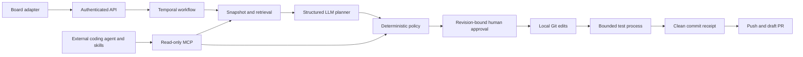

# Architecture and decisions

## Durable orchestration, deterministic boundary

Workflow state and approval signals live in Temporal history. Workflows import only pure Zod contracts and activity types. ESLint enforces this seam; integration tests exercise actual workflow bundles, failures, revision limits, stale decisions, and worker restart/replay. Side effects run in activities with finite retries. `PolicyError` and permanent GitHub errors fail without repeated attempts; tests have cancellation and heartbeats independent of output.

Every accepted decision includes `planRevision`; only the first valid decision while waiting is accepted. The same approved plan is passed to implementation, with no second code generation. The task ID determines the workflow ID, and reuse is rejected even after completion. Approval can wait indefinitely by design; operators can terminate abandoned workflows using Temporal. This is not a TTL-based job queue.

## Grounding and context budget

Prepare a per-run checkout of the configured base branch (or sanitized local source copy). Save its base commit and a deterministic corpus outside the checkout. Capture at most 100 files, 96 KB total, 32 KB per file, 2,000 directory entries, and depth 8. Exclude hidden directories, symlinks, common dependency/build trees, credential filenames, binary data, and unsupported extensions. Omitted content is represented by `truncated`, not silently assumed present.

A simple lexical ranker favors filename matches and returns up to ten full files with SHA-256 citations. Gemini receives task/analysis plus selected source data and returns a schema-constrained plan. The UI exposes the captured corpus digest and size. Updating/deleting a file requires that it existed unchanged in the captured corpus. Files can still contain sensitive text under innocuous names: the operator must authorize the corpus for model/MCP access.

This is deliberately a small-repository retrieval baseline. No embeddings, vector database, reranker, or claimed semantic recall. `evals/cases.json` gives a tiny inspectable retrieval/policy regression set; it is not evidence of general RAG or live model quality.

## Execution and publication

`validatePlan` enforces limits independently of the model. The runtime planner may edit source/lib/docs or root Markdown, but cannot rewrite tests, dependency manifests, agent instructions, hidden files, or arbitrary paths. Only `npm test` and `node --test` are accepted and are spawned without a shell. Test processes receive a minimal environment and temporary HOME, have a deadline, and are killed as a process group on POSIX cancellation. Output is capped. This reduces accidental misuse; same-UID code execution still requires a trusted or separately isolated repository.

Implementation resets to the captured base, applies validated edits, and creates a local commit. Tests must pass without changing HEAD or tracked/untracked working-tree contents. A receipt records the tested commit outside the checkout. Publication checks that receipt and cleanliness again. Only then does it perform a normal push (no force) and list/create an idempotent draft PR. Remote divergence fails closed. Git credentials travel through per-process configuration, not clone URLs or stored remotes. Git hooks, external protocols, and global configuration are disabled using fixed settings.

An interrupted push/PR creation can retry safely if the same commit exists. A failure after publication may still leave an existing draft PR; the run history exposes progress. Board reporting is best-effort, not a transactional outbox or exactly-once delivery.

## MCP and reusable skills

The MCP v2 stdio server exports three read-only tools, a policy resource, and a review prompt over an operator-selected root. A real SDK client verifies protocol negotiation, discovery, retrieval, blocked paths, and the absence of an approval tool. Runtime policy is enforced even if a client ignores MCP annotations.

The runtime planner uses context modules directly. External coding agents access those modules through MCP and can follow repository-local skills. This avoids introducing an unnecessary network/protocol dependency into the worker. There is one LLM planner with separate deterministic validation gates; this is not a claimed multi-agent deliberation system. Add an independent model reviewer only after measuring whether it catches failures that deterministic gates miss.

## Operational scope

API requests are bounded and validated, bearer authentication is available and required by default in production mode, and errors exclude internal provider bodies. Metadata logs carry request IDs and workflow transition data. `/api/health` is liveness; authenticated `/api/ready` checks Temporal connectivity, not worker availability or downstream providers.

A deployment needs one worker host with persistent `.work` storage. Temporal durably stores orchestration, not filesystem bytes. Multiple workers on the same queue without shared/isolated execution storage are unsupported. See [operations](docs/OPERATIONS.md) for scaling, migration and production prerequisites.
