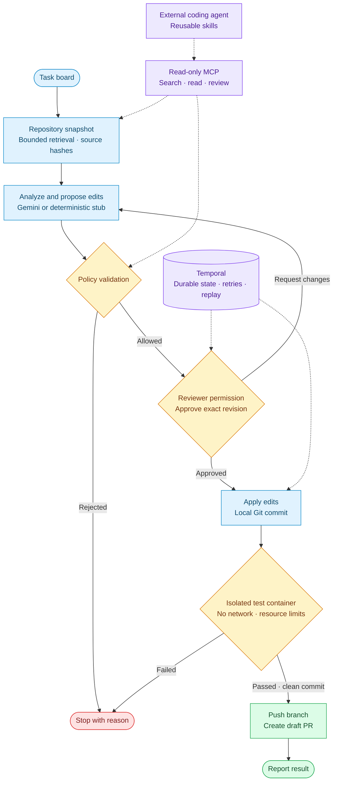

# Agent Pipeline

[](https://github.com/brezetsky/agentic-task-pipeline/actions/workflows/ci.yml)

A durable coding-agent workflow that turns a task into a reviewed, tested draft pull request. **Temporal** preserves progress and human approvals; **Gemini** proposes structured edits; deterministic policy and tests control execution.



## Run

With Docker Desktop running (Linux: set `DOCKER_SOCKET_GID` to the group owning your Docker socket):

```bash
docker compose up --build
```

Open [the app](http://localhost:3001) and [Temporal UI](http://localhost:8080). Select a task, review its proposed edits, and approve or request changes. Without credentials, planning and remote providers use deterministic mocks; Git commits and target tests still run for real.

If port 8080 is occupied, run `TEMPORAL_UI_PORT=18080 docker compose up --build` and open Temporal UI at port 18080. Stop with `docker compose down`; named volumes preserve execution state.

For host development, use Node 22.14+ or 24, npm, Git, the Temporal CLI, and a running Docker daemon. Preload the test image before starting the worker:

```bash
npm ci
docker pull node:22-slim
make dev
```

If you configure `TEST_RUNNER_IMAGE`, preload that image instead. Host development uses the same isolated test runner as Compose; it does not fall back to running repository tests on the host.

## Verify

```bash
npm run check  # formatting, lint, typechecks, tests, evaluations, web build
npm run demo   # real Temporal + Git + tests; successful and blocked-change scenarios
npm run smoke  # HTTP approval/revision flow against the running local stack
RUN_DOCKER_TESTS=1 npm test -- packages/core/src/providers/docker-runner.test.ts
```

The demo uses a temporary workspace and an ephemeral Temporal test server, ignores ambient credentials, and makes no model or GitHub calls. The test server binary downloads on first use. Evaluations cover deterministic retrieval and policy behavior; they do not measure live model quality.

## MCP and skills

Build and launch the read-only MCP server against an operator-selected repository:

```bash
npm run build
MCP_REPO_ROOT=/absolute/path/to/repository node packages/mcp/dist/server.js
```

Use that direct Node command in your MCP client's configuration. Available tools are `search_repository`, `read_context_file`, and `review_plan`; the server also exposes `pipeline://policy` and the `review-task` prompt. It cannot approve, execute, or publish changes. Repository-local skills live under [`.agents/skills`](.agents/skills); [AGENTS.md](AGENTS.md) defines engineering invariants.

## Task context

Create a task through the board or `POST /api/runs` with `{ "task": { "id": "sum-negative", "title": "Handle negative inputs", "description": "Acceptance criteria: sum(-2, 1) returns -1. Preserve the public API.", "source": "api" } }`. Put requirements, constraints and acceptance criteria in the description (up to 12,000 characters). A URL is metadata; linked pages are not fetched automatically.

The worker snapshots the configured repository before planning. Retrieval excludes hidden files, symlinks, binaries and common secret/dependency paths, with limits of 100 files, 96 KB total and 32 KB per file. Gemini receives up to ten lexically ranked files with paths and SHA-256 hashes, together with the task, analysis and latest reviewer feedback. The same snapshot is reused for revisions; changed source blocks application. Analysis itself currently uses task text only. MCP exposes the same context utilities to external coding agents; the built-in planner calls them directly.

## Access and execution

Set `API_PRINCIPALS` to a JSON array of named identities with token hashes and roles. Generate separate random bearer tokens (at least 32 random bytes) and store only their SHA-256 hex digests in this configuration:

```json
[
  { "id": "alice", "tokenSha256": "<64-character SHA-256 hex digest>", "roles": ["operator"] },
  { "id": "bob", "tokenSha256": "<different token digest>", "roles": ["reviewer"] }
]
```

All roles can read the shared project. `operator` can start runs; `reviewer` can approve or request changes; `viewer` can only read. Roles can be combined. The API supplies the reviewer identity to durable history, ignoring identities supplied by clients. Remove a principal and restart the API to revoke its token. The legacy `API_AUTH_TOKEN` grants all permissions and cannot be combined with principals. The unauthenticated local demo grants all roles visibly; configure principals before sharing access. This is project-wide RBAC, without SSO or per-run tenancy.

`EXECUTION_MODE=docker` is the default. Tests run as UID 1000 in an ephemeral container with no network, host mounts, Docker socket, Git metadata or inherited worker credentials. Only the committed archive is streamed in. The root filesystem is read-only; workspace/tmp storage, CPU, memory and process count are bounded. The runner rejects archives above 64 MiB, applies a 120-second deadline, removes containers on normal exit/cancellation and never falls back to host execution. Missing images fail closed; Compose preloads `TEST_RUNNER_IMAGE` (default `node:22-slim`). Use an audited image pinned by digest for deployment. Dependencies must already be available in that image; installation and network access during tests are disabled.

The worker needs Docker control access; Compose mounts the socket **only into the trusted worker**, never task containers. Docker socket access is powerful: use a dedicated execution host/daemon for deployment. Docker containers share a kernel and are not a VM boundary for adversarial code. Explicit trusted host development requires both `EXECUTION_MODE=local` and `ALLOW_LOCAL_EXECUTION=true`.

## Configuration

Copy `.env.example` to `.env` for live integrations:

| Variables                                                           | Purpose                                                                     |
| ------------------------------------------------------------------- | --------------------------------------------------------------------------- |
| `GOOGLE_GENERATIVE_AI_API_KEY`, `LLM_MODEL`                         | Gemini structured planning; model must be selected explicitly               |
| `TRELLO_API_KEY`, `TRELLO_TOKEN`, `TRELLO_LIST_ID`                  | Read board tasks and report results                                         |
| `GITHUB_TOKEN`, `GITHUB_OWNER`, `GITHUB_REPO`, `GITHUB_BASE_BRANCH` | Clone the configured base and publish tested draft PRs                      |
| `TARGET_REPO_PATH`                                                  | Use a local target repository                                               |
| `API_AUTH_TOKEN`                                                    | Legacy shared bearer token, at least 32 characters; prefer `API_PRINCIPALS` |
| `MAX_REVISIONS`                                                     | Maximum revision requests, 0–10; default 3                                  |

Inspect `/api/info` to confirm which providers are active. Partial credentials select mocks. Enter the API token in the UI connection form when authentication is enabled. `/api/health` checks process liveness; `/api/ready` checks Temporal connectivity. Approval requests include `planRevision` from the current run status. Reusing a task ID returns its existing run.

## Operating limits

**This is not yet a fully production-ready service.** The supported execution model is one worker with persistent `.work` storage and trusted target repositories.

- Container isolation is tested, but kernel hardening, image provenance, crash recovery and sustained adversarial/load testing still need deployment-specific validation.
- Compose is a loopback-only local deployment with authentication bypassed explicitly. Remote deployment needs HTTPS, identity/rate controls, and secured Temporal access. API roles do not protect direct Temporal access; keep Temporal/CLI access restricted to administrators.
- Task text, source context, plans, and test results can enter Temporal history. Define retention, access controls, and encryption before processing private data.
- Drain old workflow versions before rollout or implement Temporal versioning. Preserve worker storage during restarts; do not scale replicas without shared artifacts and run ownership.
- Test commands are fixed; automatic dependency installation is not implemented. Live integrations require separate validation with their real credentials. Board reporting is best-effort.
- The Terraform directory is an unapplied deployment sketch, not a verified production deployment.

Implementation is split into `core` (contracts, policy, retrieval, providers), `worker` (Temporal), `api`, `web`, and `mcp` packages. Publication requires a passing test receipt for the same clean commit and never force-pushes.
