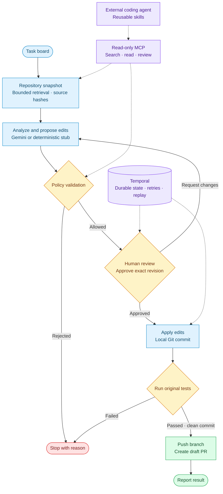

# Agent Pipeline

[](https://github.com/brezetsky/agentic-task-pipeline/actions/workflows/ci.yml)

A durable coding-agent workflow that turns a task into a reviewed, tested draft pull request. **Temporal** preserves progress and human approvals; **Gemini** proposes structured edits; deterministic policy and tests control execution.



## Run

With Docker Desktop running:

```bash
docker compose up --build
```

Open [the app](http://localhost:3001) and [Temporal UI](http://localhost:8080). Select a task, review its proposed edits, and approve or request changes. Without credentials, planning and remote providers use deterministic mocks; Git commits and target tests still run for real.

If port 8080 is occupied, run `TEMPORAL_UI_PORT=18080 docker compose up --build` and open Temporal UI at port 18080. Stop with `docker compose down`; named volumes preserve execution state.

For host development, use Node 22.14+ or 24, npm, Git, and the Temporal CLI:

```bash
npm ci
make dev
```

## Verify

```bash
npm run check  # formatting, lint, typechecks, tests, evaluations, web build
npm run demo   # real Temporal + Git + tests; successful and blocked-change scenarios
npm run smoke  # HTTP approval/revision flow against the running local stack
```

The demo uses a temporary workspace and an ephemeral Temporal test server, ignores ambient credentials, and makes no model or GitHub calls. The test server binary downloads on first use. Evaluations cover deterministic retrieval and policy behavior; they do not measure live model quality.

## MCP and skills

Build and launch the read-only MCP server against an operator-selected repository:

```bash
npm run build
MCP_REPO_ROOT=/absolute/path/to/repository node packages/mcp/dist/server.js
```

Use that direct Node command in your MCP client's configuration. Available tools are `search_repository`, `read_context_file`, and `review_plan`; the server also exposes `pipeline://policy` and the `review-task` prompt. It cannot approve, execute, or publish changes. Repository-local skills live under [`.agents/skills`](.agents/skills); [AGENTS.md](AGENTS.md) defines engineering invariants.

## Configuration

Copy `.env.example` to `.env` for live integrations:

| Variables                                                           | Purpose                                                                      |
| ------------------------------------------------------------------- | ---------------------------------------------------------------------------- |
| `GOOGLE_GENERATIVE_AI_API_KEY`, `LLM_MODEL`                         | Gemini structured planning; model must be selected explicitly                |
| `TRELLO_API_KEY`, `TRELLO_TOKEN`, `TRELLO_LIST_ID`                  | Read board tasks and report results                                          |
| `GITHUB_TOKEN`, `GITHUB_OWNER`, `GITHUB_REPO`, `GITHUB_BASE_BRANCH` | Clone the configured base and publish tested draft PRs                       |
| `TARGET_REPO_PATH`, `ALLOW_LOCAL_EXECUTION`                         | Use a trusted local target; custom target execution requires explicit opt-in |
| `API_AUTH_TOKEN`                                                    | Bearer token, at least 32 characters; required by default in production mode |
| `MAX_REVISIONS`                                                     | Maximum revision requests, 0–10; default 3                                   |

Inspect `/api/info` to confirm which providers are active. Partial credentials select mocks. Enter the API token in the UI connection form when authentication is enabled. `/api/health` checks process liveness; `/api/ready` checks Temporal connectivity. Approval requests include `planRevision` from the current run status. Reusing a task ID returns its existing run.

## Operating limits

**This is not yet a fully production-ready service.** The supported execution model is one worker with persistent `.work` storage and trusted target repositories.

- Tests run repository code under the worker's OS user. Path restrictions, filtered environment variables, and timeouts are not a hostile-code sandbox. Untrusted code needs isolated runners, restricted egress, and separated credentials.
- Compose is a loopback-only local deployment with authentication bypassed explicitly. Remote deployment needs HTTPS, identity/rate controls, and secured Temporal access. Shared API tokens do not provide team RBAC.
- Task text, source context, plans, and test results can enter Temporal history. Define retention, access controls, and encryption before processing private data.
- Drain old workflow versions before rollout or implement Temporal versioning. Preserve worker storage during restarts; do not scale replicas without shared artifacts and run ownership.
- Test commands are fixed; automatic dependency installation is not implemented. Live integrations require separate validation with their real credentials. Board reporting is best-effort.
- The Terraform directory is an unapplied deployment sketch, not a verified production deployment.

Implementation is split into `core` (contracts, policy, retrieval, providers), `worker` (Temporal), `api`, `web`, and `mcp` packages. Publication requires a passing test receipt for the same clean commit and never force-pushes.
